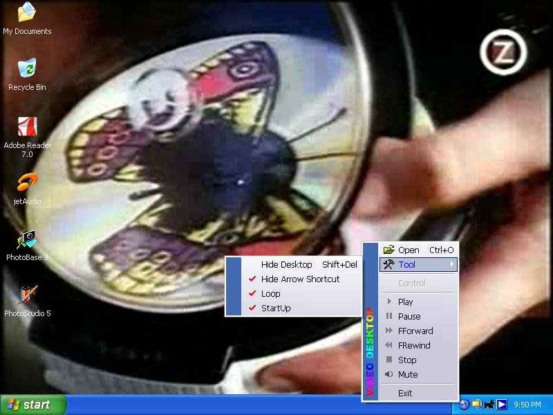



## VIDEO DESKTOP update version

### Description

This is a MPEG player that can be played on desktop (under icon) without change desktop wallpaper.

On this,you will know a magic color transparent for video player (RGB :16,0,16).To do with that color

you have to work with registry. With this color magic, you can make an video application more interesting.

an OSD or any control can be placed over the player display. Explore your creation whit this color.
 
### More Info
 

             |
---                |---
**Submitted On**   |2005-09-02 09:53:24
**By**             |[joko mulyono](https://github.com/Planet-Source-Code/PSCIndex/blob/master/ByAuthor/joko-mulyono.md)
**Level**          |Intermediate
**User Rating**    |4.7 (66 globes from 14 users)
**Compatibility**  |VB 5\.0, VB 6\.0
**Category**       |[Complete Applications](https://github.com/Planet-Source-Code/PSCIndex/blob/master/ByCategory/complete-applications__1-27.md)
**World**          |[Visual Basic](https://github.com/Planet-Source-Code/PSCIndex/blob/master/ByWorld/visual-basic.md)
**Archive File**   |[VIDEO\_DESK1933129162005\.zip](https://github.com/Planet-Source-Code/joko-mulyono-video-desktop-update-version__1-62581/archive/master.zip)

